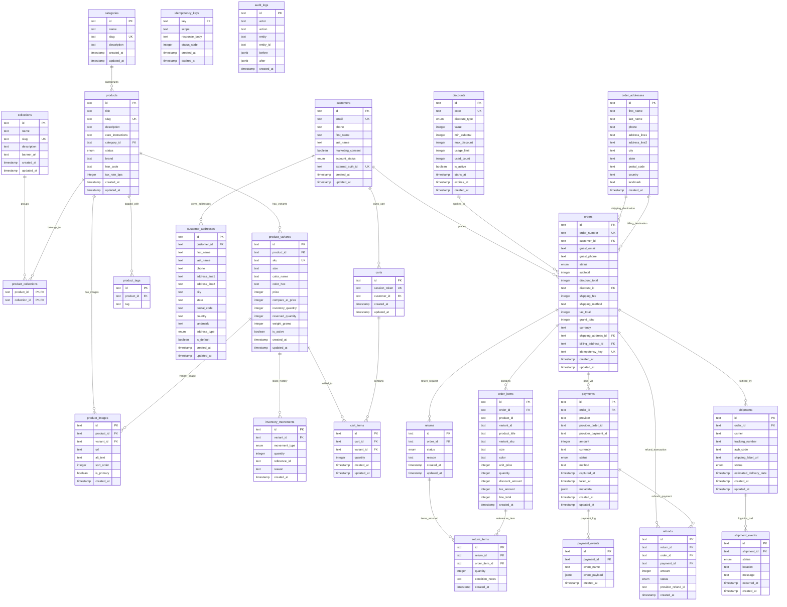

# Yaperz — PostgreSQL Relational Entity-Relationship Diagram (ERD)

> **Schema Source**: `src/lib/db/schema.ts`  
> **Target Engine**: PostgreSQL 16+ via Drizzle ORM  
> **Entity Count**: 20 Normalized Tables & 11 Postgres Enums  

---

## 1. Complete Relational ERD

---

## 2. Table Indexing & Uniqueness Constraints

| Table | Index Name | Indexed Columns | Type | Purpose |
| :--- | :--- | :--- | :--- | :--- |
| `products` | `idx_products_slug` | `slug` | Unique | Clean SEO product routing |
| `products` | `idx_products_category` | `category_id` | B-Tree | Category navigation queries |
| `product_variants` | `idx_variants_sku` | `sku` | Unique | SKU inventory tracking |
| `product_variants` | `idx_variants_product` | `product_id` | B-Tree | Fetch variants for PDP |
| `orders` | `idx_orders_number` | `order_number` | Unique | Customer tracking lookup |
| `orders` | `idx_orders_idempotency` | `idempotency_key` | Unique | Duplicate checkout prevention |
| `customers` | `idx_customers_email` | `email` | Unique | Unique customer identity |
| `carts` | `idx_carts_session` | `session_token` | Unique | Cookie-based cart retrieval |
